# CS 184: Computer Graphics and Imaging, Spring 2023

## Project 3-1: PathTracer
## Michael Lin, Rachel Lee
 *** 
### Overview
In this project, we generated camera rays by transforming normalized image coordinates from image space to sensors in camera space and then transforming the camera ray into a ray in the world space. We also generated pixel samples and implemented the Möller Trumbore algorithm for calculating ray-triangle intersections. Then, using Bounding Volume Heirarchy acceleration we increased the efficiency of the ray-tracing processes by using the bounding box's surface area in our heuristics.
### Part 1
- **Walk through the ray generation and primitive intersection parts of the rendering pipeline.**
  - To generate the ray, we first transform the normalized input coordinates ```(x,y)``` from the world space to camera space by setting ```xTransform``` to ```x * tan(.5 * radians(hFov)) + (x - 1) * tan(.5 * radians(hFov))``` and ```yTransform``` to  ```y * tan(.5 * radians(hFov)) + (x - 1) * tan(.5 * radians(hFov))```. After transforming the coordinates from image space to sensor in camera space, we then transform the ```xTransform``` and ```yTransform``` coordinates into the world space by finding the updated direction and multiplying by the camera-to-world rotation matrix ```c2w```. Then, we create and return a new ```cameraRay``` using the camera position in the world space pos and updated direction vector while also setting the ```min_t``` and ```max_t``` of the ray to be within the bounds of the two clipping planes ```nclip``` and ```fclip```. After generating the ray and pixel samples using ```raytrace_pixel```, we test whether there is an intersection between the triangle and input ray using the Möller Trumbore algorithm and reporting the location of the nearest intersection point. Finally, we check if the found intersection point is within the triangle’s boundaries.

- **Explain the triangle intersection algorithm you implemented in your own words.**
  - In ```Triangle::intersect``` , we implemented the Möller Trumbore algorithm by using linear interpolation to calculate the barycentric coordinates and determine if the intersection point of the ray lies within the triangle. First, we found two edges of the triangle py calculating the difference of ```p2 - p1 ```and ```p3 - p1``` and stored them in ```e1``` and ```e2```, respectively. Then we found the distance of ```p1``` from the given ray’s origin and used it to find the cross product between e1 and store this in ```s1```. We also found the cross product between the ray’s direction and ```e2``` and store this value in ```s2```. Next, we calculate the inverse of the dot products using: ```1 / dot(s1, e1) * Vector3D(dot(s2, e2), dot(s1, s0), dot(s2, r.d))``` and store the result in a ```Vector3D```. Finally, we check that the coordinates of the resulting vector are within the range (0,1) and that the intersection that occurs at t lies within the ```min_t``` and ```max_t``` of the input array and update ```max_t``` if necessary.
- **Show images with normal shading for a few small .dae files.**
  - ```CBEmpty.dae```
  - 
  - ```CBSpheres.dae```
  - 
  - ```banana.dae```
  - 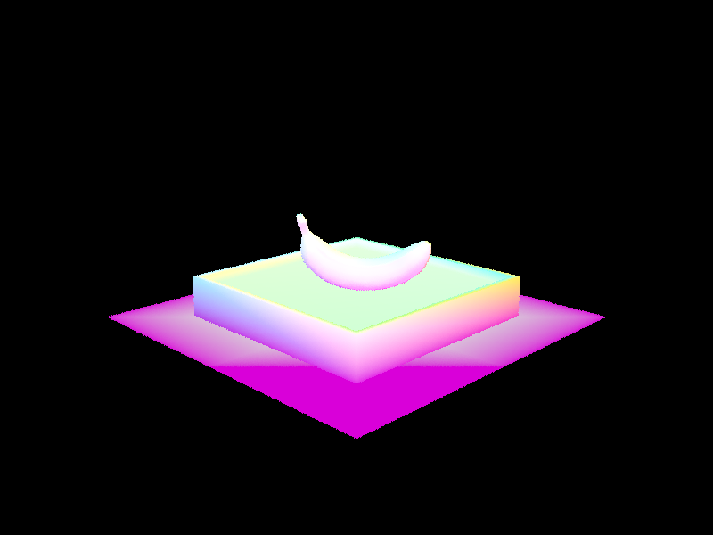

### Part 2
- **Walk through your BVH construction algorithm. Explain the heuristic you chose for picking the splitting point.**
  - In ```BVHAccel:construct_bvh```, we first compute the bounding box from the given vector of primitives using ```get_bbox()``` and initialize a new BVHNode with the bounding box. Then, we check to see if the current node is a leaf node by seeing if there are no more than ```max_leaf_size``` primitives in the list, and then update the start and end primitive iterators. If the node is an internal node, then we split the primitives into “left” and “right” sections along the longest axis of the bounding box within bbox.extent. After finding the longest axis for the split and assuming the probability of intersection is proportional to the surface area of the bounding box, we split the result in maximum entropy reduction. Since we are splitting two ways, that means the probability on each side should be as close to 0.5 as possible:

```
sort(axis.begin(), axis.end(), [i](Primitive *lhs, Primitive *rhs){
            double lhsAxisValue = lhs->get_bbox().centroid()[i];
            double rhsAxisValue = rhs->get_bbox().centroid()[i];
            if (lhsAxisValue == rhsAxisValue) {
                return lhs->get_bbox().surface_area() < rhs->get_bbox().surface_area();
            } else {
                return lhs->get_bbox().centroid()[i] < rhs->get_bbox().centroid()[i];
            }
        });
splitAreas[i] = -totalArea / 2;

for (auto p = axis.begin(); p != axis.end(); p++) {
    splitAreas[i] += (*p)->get_bbox().surface_area();
    axisSplitPoints[i] = (*p)->get_bbox().centroid()[i];
    if (splitAreas[i] > 0) {
        break;
    }
}
```
  - If the split point is at the start or end, then we know that all primitives lie on only one side of the split point and can return the current node. Otherwise, we create a new node with updated start and end primitives and recursively call construct_bvh on the new Primitive vector.

- **Show images with normal shading for a few large .dae files that you can only render with BVH acceleration.**
    - ```CBbunny.dae```
    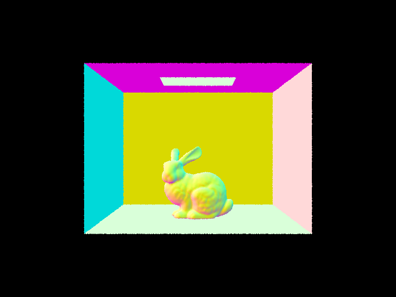
    - ```cow.dae```
    
    - ```CBlucy.dae```
    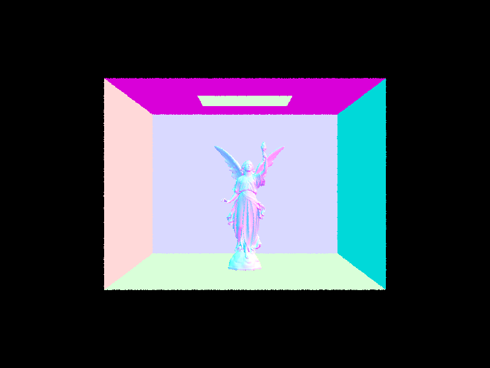

- **Compare rendering times on a few scenes with moderately complex geometries with and without BVH acceleration. Present your results in a one-paragraph analysis.**
  - **Without BVH Acceleration:**
  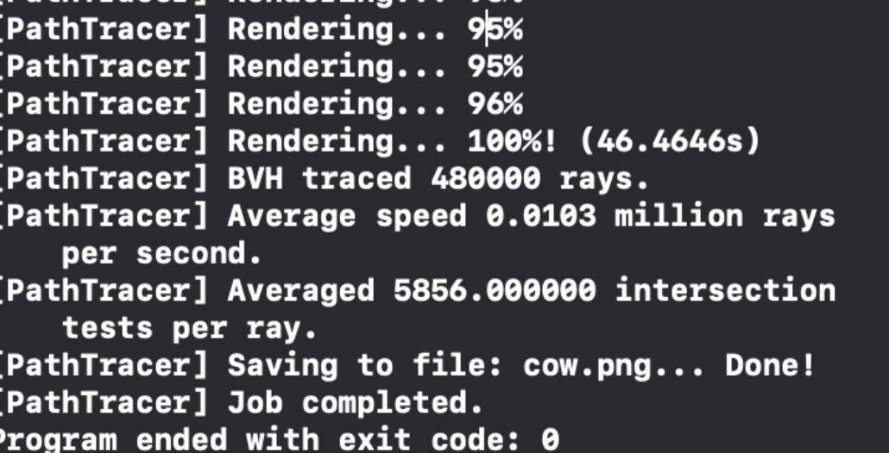
  - **With BVH Acceleration:**
  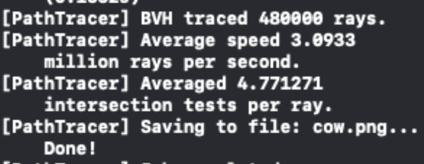
  - Clearly, we can distinguish the difference between the average speed of the million rays/second without BVH acceleration and with BVH acceleration and see that the one processed with BVH acceleration was ~30x faster. The average number of intersection tests per ray also significantly decreased which shows the increased efficiency of the ray-tracing algorithm for identifying which bounding boxes intersect with the ray while also eliminating computation time for rays that do not intersect.

### Part 3
- **Walk through both implementations of the direct lighting function.**
  - In direct lighting with uniform hemisphere sampling, we estimate the direct lighting on a point by sampling uniformly in a hemisphere. First, we make a coordinate space for the hit point ```hit_p``` in the Z direction, aligned with the surface normal N. Then, we iterate through the total number of pixel samples and generate a random direction of the unit hemisphere with ```hemisphereSampler->get_sample()``` Then, we create a new ray using the hit point and randomly generated direction and check if it intersects with an object by calling ```bvh->intersect```. We keep track of a running sum ```L_out``` of the total lighting emitted and finally return the estimated direct lighting for the hit point by dividing the total sum by the total area of samples: ```L_out / num_samples * PI * 2```.  This formula is derived from the estimator equation: 
  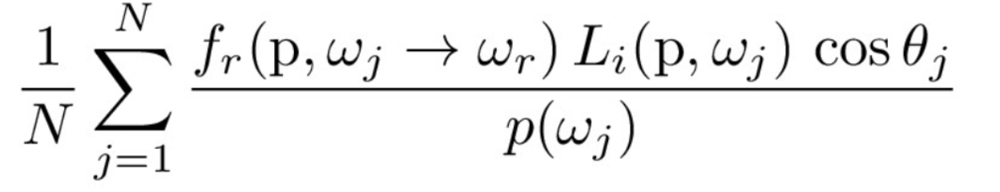
  - In  ```PathTracer::estimate_direct_lighting_importance```, we implemented direct lighting with importance sampling lights by sampling all lights directly and tracing the inverse path of the light. First, we iterate through each light source and sample directions between the light source and the hit point ```hit_p```. For each sample in the light source, we calculate the distance to the source light, probability density, radiance, and calculate a new ray from the hit point to the light source to check if an intersection occurs. We use the sample estimation formula above to calculate a running sum L_out of the total light samples, while also accounting for the extra factor of radiance and probability density: ```L_out += isect.bsdf->f(w_out, w_in_object) * radiance * max(0., cos_theta(w_in_object)) / probability_density / num_sample``` and return the result.

- **Show some images rendered with both implementations of the direct lighting function.**
  - Uniform Hemisphere Sampling:
  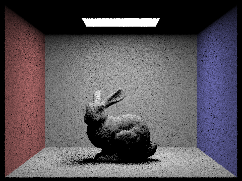
  - Importance Sampling:
  

- **Focus on one particular scene with at least one area light and compare the noise levels in soft shadows when rendering with 1, 4, 16, and 64 light rays (the -l flag) and with 1 sample per pixel (the -s flag) using light sampling, not uniform hemisphere sampling.**
  - ```l=1:```
  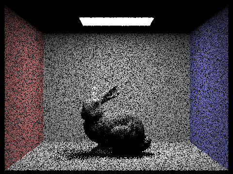
  - ```l=4:```
  
  - ```l=16:```
  
  - ```l=64:```
  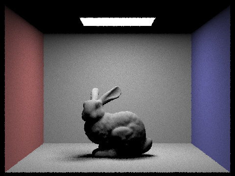

- **Compare the results between uniform hemisphere sampling and lighting sampling in a one-paragraph analysis.**
  - In the image produced by uniform hemisphere sampling, we see that the result is more grainy with increased noise due to the sampling over a uniform hemisphere, which samples directions randomly with uniform probability over a hemisphere. However, in the bunny image produced by importance sampling, the image is much clearer since we include the difference in light directions when sampling and weigh greater probabilities and importance towards surfaces that are hit by a light source, rather than the shadows of the image.

### Part 4
- **Walk through your implementation of the indirect lighting function.**
- **Show some images rendered with global (direct and indirect) illumination. Use 1024 samples per pixel.**
  - ```banana.dae:```
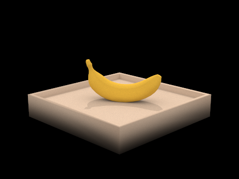
  - ```blob.dae:```
  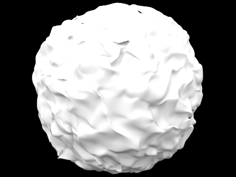
  - ```spheres.dae:```
  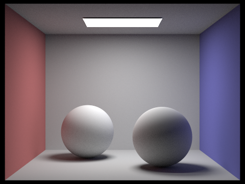
- **Pick one scene and compare rendered views first with only direct illumination, then only indirect illumination. Use 1024 samples per pixel.**
- Direct illumination:
  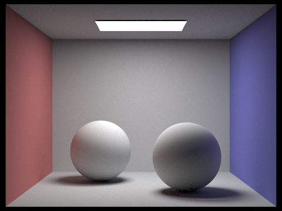
- Indirect illumination:
  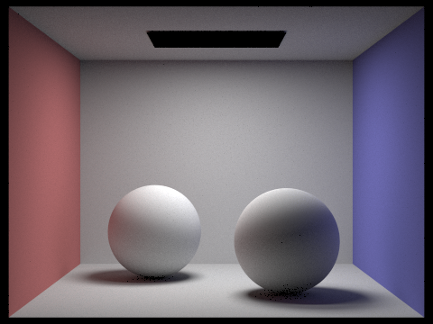
- **For CBbunny.dae, compare rendered views with max_ray_depth set to 0, 1, 2, 3, and 100 (the -m flag). Use 1024 samples per pixel.**
- **Pick one scene and compare rendered views with various sample-per-pixel rates, including at least 1, 2, 4, 8, 16, 64, and 1024. Use 4 light rays.**

### Part 5
  - **Explain adaptive sampling. Walk through your implementation of the adaptive sampling.**
  - **Pick two scenes and render them with at least 2048 samples per pixel. Show a good sampling rate image with clearly visible differences in sampling rate over various regions and pixels. Include both your sample rate image, which shows your how your adaptive sampling changes depending on which part of the image you are rendering, and your noise-free rendered result. Use 1 sample per light and at least 5 for max ray depth.**